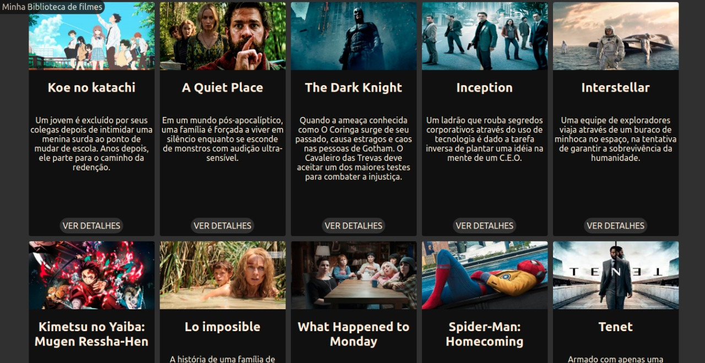

# My Movie Library

# Contexto
Este projeto trata-se de uma biblioteca de filmes que permite modificar os existentes e possui informações sobre os mesmos.



## Técnologias usadas

Front-end:
> Desenvolvido usando: React, CSS3, HTML5, ES6

## Instalando Dependências

> Frontend
```bash
cd src/
npm install
``` 
## Executando aplicação

* Para rodar o front-end:

  ```
    cd src/ && npm start
  ```
